<pre>
 _   _          ______                _____           _     __   __      _                     
| | | |         | ___ \              /  __ \         | |    \ \ / /     | |                    
| |_| | _____  _| |_/ /__ _ _   _ ___| /  \/ ___   __| | ___ \ V / _ __ | | ___  _ __ ___ _ __ 
|  _  |/ _ \ \/ /    // _` | | | / __| |    / _ \ / _` |/ _ \/   \| '_ \| |/ _ \| '__/ _ \ '__|
| | | |  __/>  <| |\ \ (_| | |_| \__ \ \__/\ (_) | (_| |  __/ /^\ \ |_) | | (_) | | |  __/ |   
\_| |_/\___/_/\_\_| \_\__,_|\__, |___/\____/\___/ \__,_|\___\/   \/ .__/|_|\___/|_|  \___|_|   
                             __/ |                                | |                          
                            |___/                                 |_|</pre>
============================================================================

[](http://www.gnu.org/licenses/gpl-3.0)
[](https://codeclimate.com/github/REhints/HexRaysCodeXplorer)
[](https://codeclimate.com/github/REhints/HexRaysCodeXplorer)

The Hex-Rays Decompiler plugin for better code navigation in RE process. CodeXplorer automates code REconstruction of C++ applications or modern malware like Stuxnet, Flame, Equation, Animal Farm ... :octocat:

The CodeXplorer plugin is one of the [first publicly available](https://www.hex-rays.com/products/decompiler/manual/third_party.shtml) Hex-Rays Decompiler plugins. We keep updated this project [since summer of 2013](https://www.hex-rays.com/contests/2013/) and continue contributing new features frequently. Also most interesting feutures of CodeXplorer have been presented on numerous security conferences like: REcon, ZeroNights, H2HC, NSEC and BHUS :space_invader:

__Contributors__: 

Alex Matrosov ([@matrosov](https://github.com/matrosov))

Eugene Rodionov ([@rodionov](https://github.com/rodionov)) 

Rodrigo Branco ([@rrbranco](https://github.com/rrbranco))

Gabriel Barbosa ([@gabrielnb](https://github.com/gabrielnb))

__Supported versions of Hex-Rays products:__ everytime we focus on last versions of IDA and Decompiler because trying to use new interesting features in new SDK releases. It's also mean we tested just on last versions of Hex-Rays products and not guaranteed stable work on previous ones. 

__Why not IdaPython:__ all code developed on C/C++ because it's more stable way to support complex plugin for Hex-Rays Decompiler.

__Supported Platforms:__ x86/x64 for Win, Linux and Mac.

__HexRaysCodeXplorer__ - Hex-Rays Decompiler plugin for easier code navigation. Right-click context menu in the Pseudocode window shows CodeXplorer plugin commands: 

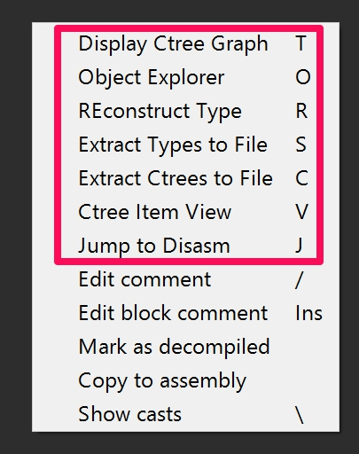

:gem: __Here are the main features of the CodeXplorer plugin:__ :gem:

* ***Automatic type REconstruction*** for C++ objects. To be able to reconstruct a type using HexRaysCodeXplorer one needs to select the variable holding pointer to the instance of position independed code or to an object and by right-button mouse click select from the context menu «REconstruct Type» option:

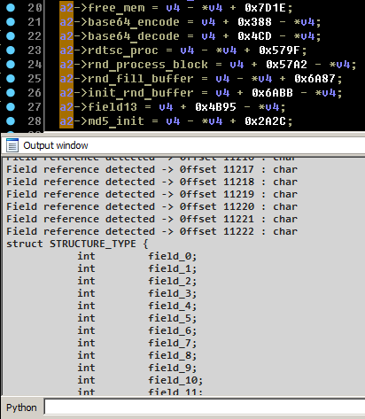

The reconstructed structure is displayed in “Output window”. Detailed information about type Reconstruction feature is provided in the blog post “[Type REconstruction in HexRaysCodeXplorer](http://rehints.com/2013-09-02-Type-REconstruction-in-HexRaysCodeXplorer.html)”.

Also CodeXplorer plugin supports auto REconstruction type into IDA local types storage.

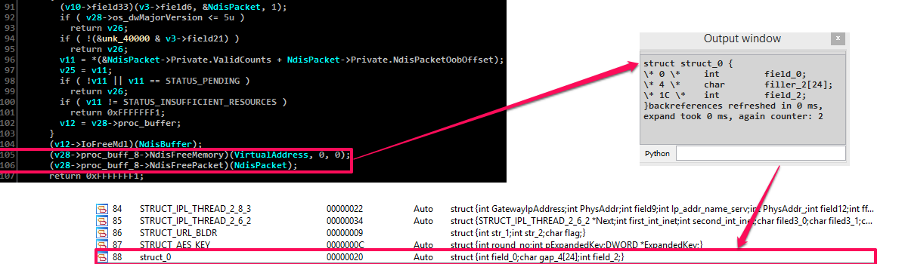

* ***Virtual function table identification***  - automatically identifies references to virtual function tables during type reconstruction. When a reference to a virtual function table is identified the plugin generates a corresponding C-structure. As shown below during reconstructing `struct_local_data_storage` two virtual function tables were identified and, as a result, two corresponding structures were generated: `struct_local_data_storage_VTABLE_0` and `struct_local_data_storage_VTABLE_4`.

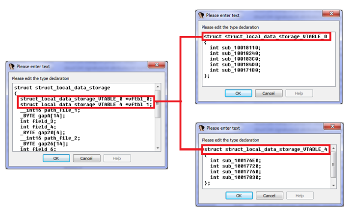
  
* ***C-tree graph visualization*** – a special tree-like structure representing a decompiled routine in citem_t terms (hexrays.hpp). Useful feature for understanding how the decompiler works. The highlighted graph node corresponds to the current cursor position in the HexRays Pseudocode window:

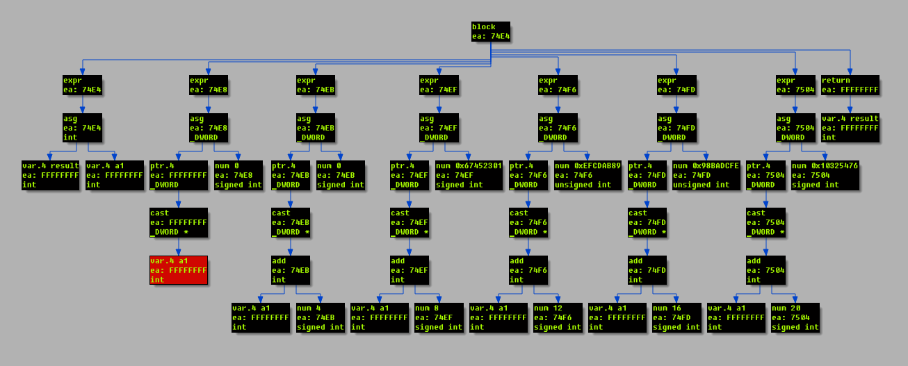

* ***Ctree Item View*** – show ctree representation for highlighted element:

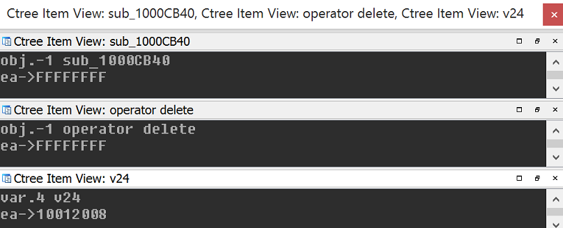

* ***Extract Ctrees to File*** – dump calculate SHA1 hash and dump all ctrees to file. 

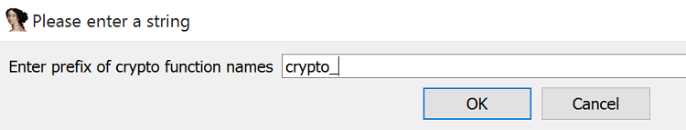

* ***Extract Types to File*** – dump all types information (include reconstructed types) into file.

* ***Navigation through virtual function calls*** in HexRays Pseudocode window. After representing C++ objects by C-structures this feature make possible navigation by mouse clicking to the virtual function calls as structure fields:

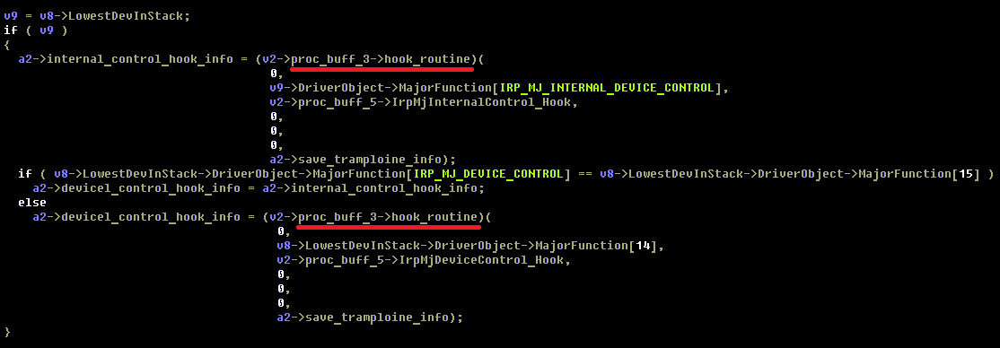

* ***Jump to Disasm*** - small feature for navigate to assembly code into "IDA View window" from current Pseudocode line position. It is help to find a place in assembly code associated with decompiled line. 


* ***Object Explorer*** – useful interface for navigation through virtual tables (VTBL) structures. Object Explorer outputs VTBL information into IDA custom view window. The output window is shown by choosing «Object Explorer» option in right-button mouse click context menu:

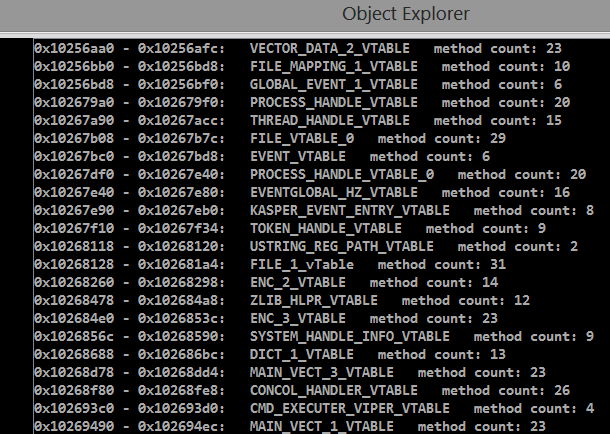

__Object Explorer supports following features:__
* Auto structures generation for VTBL into IDA local types

* Navigation in virtual table list and jump to VTBL address into "IDA View" window by click

* Show hints for current position in virtual table list

* Shows cross-references list by click into menu on "Show XREFS to VTBL"

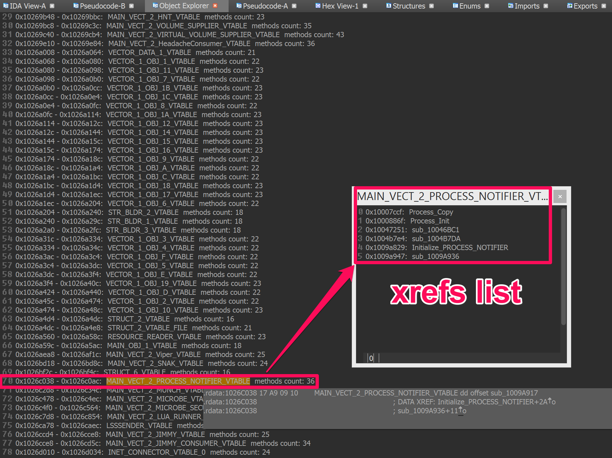

* Support auto parsing RTTI objects:

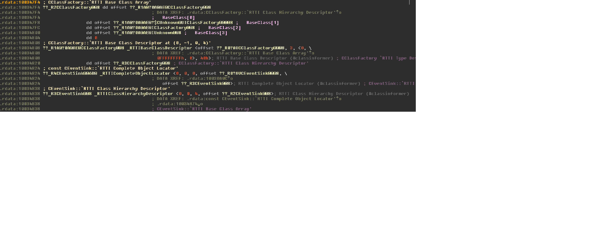

__The Batch mode contains following features:__

* Batch mode - useful feature to use CodeXplorer for processing multiple files without any interaction from user. We add this feature after Black Hat research in 2015 for processing 2 millions samples.

```
Example (dump types and ctrees for functions with name prefix "crypto_"):
idaq.exe -OHexRaysCodeXplorer:dump_types:dump_ctrees:CRYPTOcrypto_path_to_idb
```

__Compiling__:

***Windows***: 
* Open the solution in Visual Studio
* Open file `src/HexRaysCodeXplorer/PropertySheet.props` in notepad(++) and update values of `IDADIR` and `IDASDK` paths to point to IDA installation path and IDA7 SDK path accordingly. HexRays SDK should be in `$IDADIR\plugins\hexrays_sdk` (like by default)
* Build `Release | x64` and `Release x64 | x64` configurations

***Linux***:
* cd src/HexRaysCodeXplorer/
* IDA_DIR=<PATH_TO_IDA> IDA_SDK=<PATH_TO_IDA_SDK> EA64=0 make -f makefile.lnx
* IDA_DIR=<PATH_TO_IDA> IDA_SDK=<PATH_TO_IDA_SDK> EA64=0 make -f makefile.lnx install
  
***Mac***:
* cd src/HexRaysCodeXplorer/
* IDA_DIR=<PATH_TO_IDA> IDA_SDK=<PATH_TO_IDA_SDK> make -f makefile.mac
* The Mac makefile might need some hand editing, pull requests welcome!
* IDA 7.0 `.pmc` file extension should be `.dylib`
* bash$ `export IDA_DIR="/Applications/IDA\ Pro\ 7.0/ida.app/Contents/MacOS" && export IDA_SDK="/Applications/IDA\ Pro\ 7.0/ida.app/Contents/MacOS/idasdk" && make -f makefile7.mac`
* Or open project in Xcode `HexRaysCodeXplorer.xcodeproj`

***With CMake***:
* cd src/HexRaysCodeXplorer/
* mkdir build && cd build
* cmake .. -DIdaSdk_ROOT_DIR=<PATH_TO_IDA_SDK> -DHexRaysSdk_ROOT_DIR=<PATH_TO_HEXRAYS_SDK>
* cmake --build . --config Release

============================================================================

__Conference talks about CodeXplorer plugin:__
* **2015**
 * "Distributing the REconstruction of High-Level IR for Large Scale Malware Analysis", BHUS [[slides]](https://github.com/REhints/Publications/blob/master/Conferences/BH'2015/BH_2015.pdf) 
 * "Object Oriented Code RE with HexraysCodeXplorer", NSEC [[slides]](https://github.com/REhints/Publications/raw/master/Conferences/Nsec'2015/nsec_2015.pdf)
* **2014**
 * "HexRaysCodeXplorer: object oriented RE for fun and profit", H2HC [[slides]](https://github.com/REhints/Publications/blob/master/Conferences/ZeroNights'2013/ZN_2013_pdf.pdf)
* **2013**
 * "HexRaysCodeXplorer: make object-oriented RE easier", ZeroNights [[slides]](https://github.com/REhints/Publications/blob/master/Conferences/ZeroNights'2013/ZN_2013_pdf.pdf)
 * "Reconstructing Gapz: Position-Independent Code Analysis Problem", REcon [[slides]](https://github.com/REhints/Publications/blob/master/Conferences/RECON'2013/RECON_2013.pdf)
